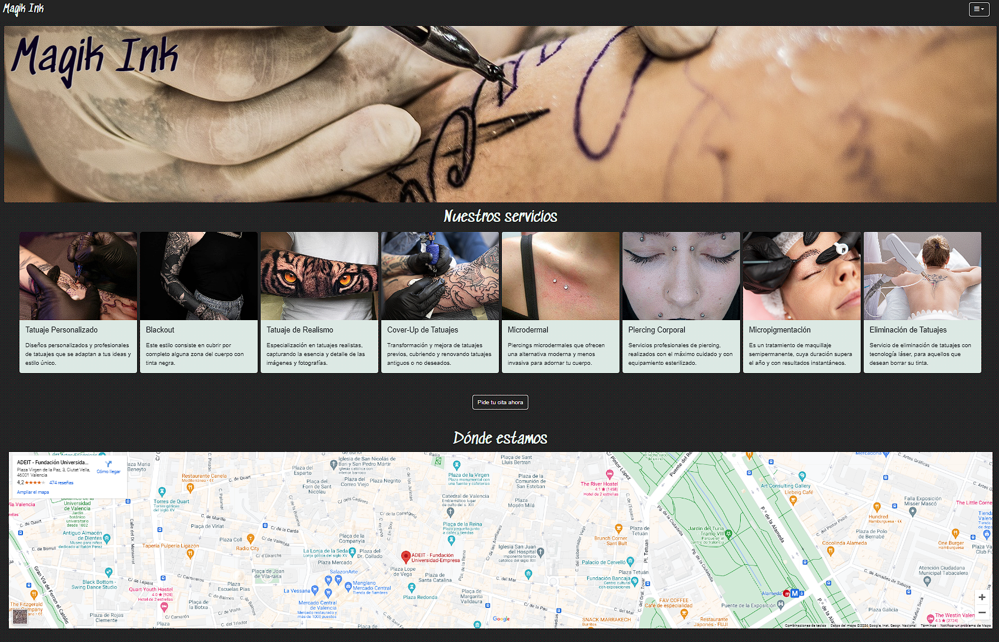
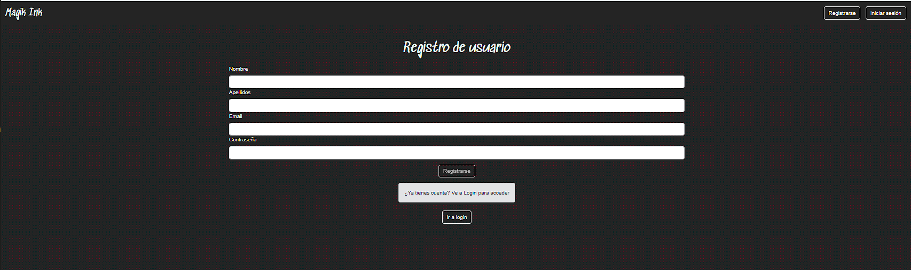
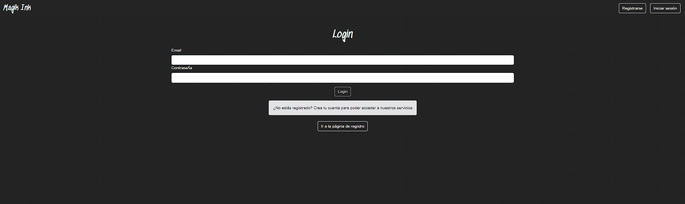
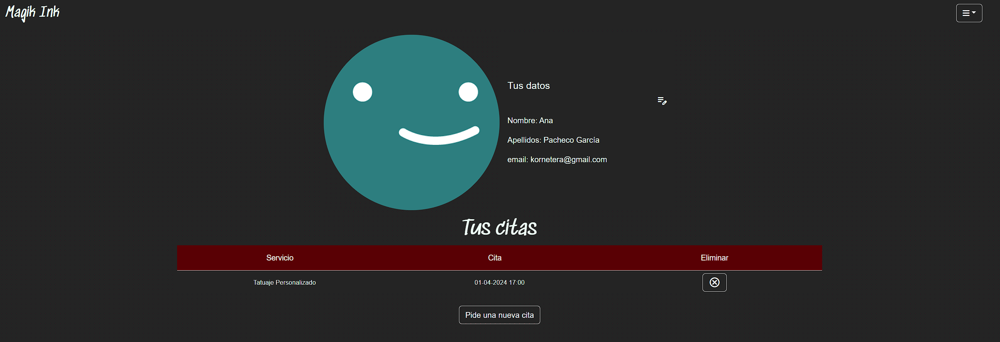
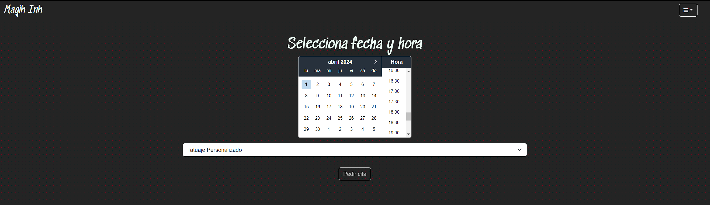
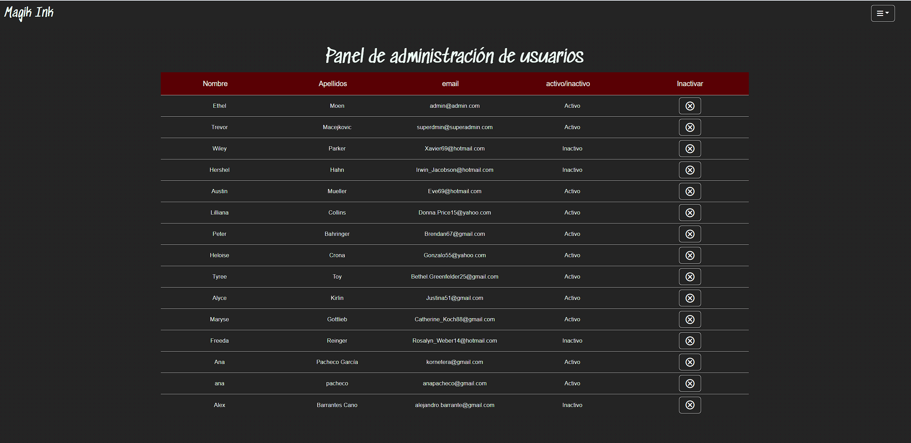

# Estudio de Tatuajes Magik Ink  

<details>
  <summary>Contenido 📝</summary>
  <ol>
    <li><a href="#objetivo-🎯">Objetivo</a></li>
    <li><a href="#sobre-el-proyecto-🔎">Sobre el proyecto</a></li>
    <li><a href="#deploy-🚀">Deploy</a></li>
    <li><a href="#stack">Stack</a></li>
    <li><a href="#instalación-en-local">Instalación</a></li>
    <li><a href="#vistas">Vistas</a></li>
    <li><a href="#futuras-funcionalidades">Futuras funcionalidades</a></li>
    <li><a href="#contribuciones">Contribuciones</a></li>
    <li><a href="#webgrafia">Webgrafia</a></li>
    <li><a href="#contacto">Contacto</a></li>
  </ol>
</details>

## Objetivo 🎯
Este proyecto requería conexión a una API funcional y usar react para crear una web que conecte con la API encargada de gestionar el modelo de negocio de un estudio de tatuajes 

Repoistorio de la api: https://github.com/aipacheco/Proyecto4-tatuajes

  
  
## Deploy 🚀
<div align="center">
    <a href="https://main.d1y1fhubg3l0md.amplifyapp.com/"><strong>Url a producción </strong></a>🚀🚀🚀
</div>

## Stack
<div align="center">
<a href="https://www.reactjs.com/">
    
</a>
<a href="https://developer.mozilla.org/es/docs/Web/JavaScript">
    
</a>
  <a href="https://getbootstrap.com/">
    
</a>
  <a href="https://developer.mozilla.org/es/docs/Web/CSS">
    
</a>
 
 </div>

## Instalación en local
1. Clonar el repositorio
2. ` $ npm install `
3. ``` $ npm run dev ```


## Vistas
Landing
  
Register

Login

Profile

Appointments

Admin


## Futuras funcionalidades
  
⬜ Cambio de imagen del usuario 

⬜ Vista detallada de servicio 

⬜ Posibilidad de volver a activar un usuario desde Admin  


## Contribuciones
Las sugerencias y aportaciones son siempre bienvenidas.  

Puedes hacerlo de dos maneras:

1. Abriendo una issue
2. Crea un fork del repositorio
    - Crea una nueva rama  
        ```
        $ git checkout -b feature/nombreUsuario-mejora
        ```
    - Haz un commit con tus cambios 
        ```
        $ git commit -m 'feat: mejora X cosa'
        ```
    - Haz push a la rama 
        ```
        $ git push origin feature/nombreUsuario-mejora
        ```
    - Abre una solicitud de Pull Request


## Webgrafia:
Para conseguir mi objetivo he recopilado información de:
- https://react-data-table-component.netlify.app/?path=/docs/getting-started-intro--docs
- https://mui.com/x/react-date-pickers/date-picker/
 

## Contacto

<a href = "mailto:aipachecogarcia@gmail.com
"></a>
<a href="https://www.linkedin.com/in/anapachecogarcia/" target="_blank"></a>
</p>
